# 10 RAG Architectures — LangGraph + LangChain + Groq + FastAPI + React

This project provides runnable code examples and visual flowcharts for ten different Retrieval-Augmented Generation (RAG) architectural patterns. Each design is implemented as an explicit LangGraph workflow, using ChromaDB for vector retrieval, local Hugging Face sentence transformers for embeddings, and Groq for fast LLM responses.

---

## Required API Keys and Environment Setup

To run either the command-line scripts or the Web application, you will need a Groq API key to handle LLM generations.

### Required Key
- **GROQ_API_KEY**: Needed for LLM inference (e.g. `openai/gpt-oss-20b` or `openai/gpt-oss-120b`).
  - You can sign up for a free key at https://console.groq.com/keys
  - Create a `.env` file in the project folder (or edit the included `.env` file):
    ```env
    GROQ_API_KEY=gsk_your_groq_api_key_here
    GROQ_MODEL=openai/gpt-oss-20b
    ```

### Local Dependencies (No API Keys Required)
- **Embeddings**: Uses `sentence-transformers/all-MiniLM-L6-v2` running locally on your machine via Hugging Face (`langchain-huggingface`).
- **Vector Database**: Uses ChromaDB running in-memory (`chromadb`).
- **Knowledge Graph**: Uses NetworkX directed graphs in-memory (`networkx`).

---

## Quickstart: Web Application (FastAPI + React)

Launch the web app to test each architecture interactively:

```bash
# 1. Install Python dependencies
pip install -r requirements.txt

# 2. Start the FastAPI backend server (Terminal 1)
python server.py

# 3. Start the React frontend dev server (Terminal 2)
cd frontend
npm install
npm run dev
```

Open **http://localhost:5173** in your browser.

### Web Application Features:
- **Sidebar Controls**: Choose from available Groq models (`gpt-oss-20b`, `gpt-oss-120b`, `llama-3.3-70b`), pick an architecture to test, and upload custom documents.
- **Live Playground**: Run queries, view execution traces, inspect retrieved source chunks, and measure response times.
- **Diagram Viewer**: Render native Mermaid.js flowcharts for each architecture type.
- **Comparison Table**: Compare all ten patterns side by side to understand trade-offs.


---

## Summary of the 10 RAG Patterns

| # | File | Pattern | Key Concept |
|---|------|---------|-------------|
| **01** | `01_standard_rag.py` | Standard RAG | Basic vector search followed by context injection and answer generation |
| **02** | `02_agentic_rag.py` | Agentic RAG | Autonomous tool-calling loop where the model decides what to search |
| **03** | `03_memory_rag.py` | RAG with Memory | Remembers short-term chat history and extracts long-term user preferences |
| **04** | `04_self_rag.py` | Self RAG | Evaluates document relevance and self-critiques answer quality |
| **05** | `05_adaptive_rag.py` | Adaptive RAG | Routes simple questions directly and breaks complex questions into sub-queries |
| **06** | `06_corrective_rag.py` | Corrective RAG (CRAG) | Filters out low-quality documents and rewrites queries when retrieval fails |
| **07** | `07_attention_rag.py` | Attention-based RAG | Calculates embedding similarity scores and highlights high-signal chunks |
| **08** | `08_hybrid_rag.py` | HybridAI RAG | Combines structured Knowledge Graph triples with unstructured vector search |
| **09** | `09_cost_constrained_rag.py` | Cost-Constrained RAG | Tracks token usage and switches to smaller models when budget runs low |
| **10** | `10_xai_rag.py` | XAI RAG (Explainable AI) | Provides explicit reasoning traces and cites exact source passage IDs |

---

## Technical Specifications by Architecture

---

### 01. Standard RAG (`01_standard_rag.py`)

#### Pipeline Overview
The classic RAG setup. The user query is converted into an embedding, matching document chunks are pulled from ChromaDB, and the context is passed to the LLM to generate an answer.

```mermaid
graph LR
    User([User Query]) --> Embed[Embedding Model]
    Embed --> VDB[(Chroma Vector DB)]
    VDB -->|Top-K Docs| Context[Context Injection]
    User --> Context
    Context --> LLM[Groq LLM]
    LLM --> Answer([Final Answer])
    style User fill:#1e293b,stroke:#38bdf8
    style VDB fill:#0f172a,stroke:#818cf8
    style LLM fill:#1e293b,stroke:#4ade80
    style Answer fill:#0f172a,stroke:#38bdf8
```



#### Technical Details:
- **State Schema (`RAGState`)**:
  ```python
  class RAGState(TypedDict):
      question: str
      documents: List[Document]
      answer: str
  ```
- **Graph Nodes**:
  - `retrieve`: Runs similarity search against the Chroma vector store with `k=3`.
  - `generate`: Formats retrieved context blocks using `format_docs()` and calls `ChatGroq`.
- **Graph Edges**: `START -> retrieve -> generate -> END`.
- **Retrieval Configuration**: `TOP_K = 3`.
- **CLI Command**:
  ```bash
  python rag_architectures/01_standard_rag.py "What are the pricing tiers?"
  ```
- **When to Use**: When your data is static or slow-changing, and queries do not require multi-step logic.
- **Common Examples**: Internal FAQ systems, documentation search, help center lookups.

---

### 02. Agentic RAG (`02_agentic_rag.py`)

#### Pipeline Overview
Instead of running a fixed pipeline, an LLM agent decides whether it needs to search the knowledge base. It can formulate search queries, inspect the returned text, and repeat the loop until it has gathered enough details to give a complete answer.

```mermaid
graph TD
    User([User Query]) --> Agent[Agent / Planner]
    Agent -->|Decide Action| Decision{Need Tools?}
    Decision -->|Yes| Tools[Search Tool Call]
    Tools -->|Return Facts| Agent
    Decision -->|No / Complete| Answer([Final Answer])
    style Agent fill:#1e293b,stroke:#c084fc
    style Tools fill:#0f172a,stroke:#38bdf8
    style Answer fill:#1e293b,stroke:#4ade80
```



#### Technical Details:
- **State Schema (`AgentState`)**:
  ```python
  class AgentState(TypedDict):
      messages: Annotated[List[AnyMessage], add_messages]
  ```
- **Graph Nodes & Components**:
  - `agent`: The LLM bound with tools using `ChatGroq.bind_tools([search_knowledge_base])`.
  - `tools`: A standard `ToolNode` that executes tool calls requested by the agent.
  - `tools_condition`: LangGraph edge logic that checks whether the model wants to invoke a tool or finish.
- **Graph Edges**: `START -> agent -> (conditional) -> tools -> agent -> END`.
- **Tool Implementation**: `@tool search_knowledge_base(query: str)` which queries the vector store with `k=3`.
- **CLI Command**:
  ```bash
  python rag_architectures/02_agentic_rag.py "Compare Nimbus Cloud's revenue growth to its churn change."
  ```
- **When to Use**: When answering a question requires multi-step investigation, looking up several pieces of data, or using external tools.
- **Common Examples**: Research assistants, financial report comparison tools.

---

### 03. RAG with Memory (`03_memory_rag.py`)

#### Pipeline Overview
Combines short-term conversational context with long-term preference storage. Short-term memory keeps track of recent turns in a discussion, while long-term memory extracts durable user facts (like dietary preferences or job roles) and stores them across sessions.

```mermaid
graph LR
    User([User Query]) --> MemRead[Load Memory Store]
    MemRead --> QueryMerge[Merge Query + Preferences]
    QueryMerge --> Retrieve[Vector DB Search]
    Retrieve --> LLM[LLM Generator]
    LLM --> MemWrite[Extract & Update Memory]
    LLM --> Answer([Personalized Answer])
    style MemRead fill:#0f172a,stroke:#c084fc
    style MemWrite fill:#0f172a,stroke:#c084fc
    style LLM fill:#1e293b,stroke:#4ade80
```



#### Technical Details:
- **State Schema (`MemoryState`)**:
  ```python
  class MemoryState(TypedDict):
      messages: Annotated[List[AnyMessage], add_messages]
      user_id: str
      question: str
      documents: list
      answer: str
  ```
- **Graph Nodes**:
  - `load_memory`: Fetches profile data from `LONG_TERM_MEMORY[user_id]` and appends known preferences to the user query.
  - `retrieve`: Runs vector retrieval using the enriched query string.
  - `generate`: Constructs the final answer using retrieved context and remembered user preferences.
  - `update_memory`: Analyzes incoming messages for new durable facts and updates the long-term dictionary.
- **Checkpointer**: Uses `MemorySaver()` to preserve short-term conversation threads (`thread_id`).
- **CLI Command**:
  ```bash
  python rag_architectures/03_memory_rag.py
  ```
- **When to Use**: When user interactions span multiple messages and remembering user preferences improves response relevance.
- **Common Examples**: Personal AI assistants, smart recommendation bots.

---

### 04. Self RAG (`04_self_rag.py`)

#### Pipeline Overview
Self RAG introduces self-assessment nodes into the graph. After documents are pulled from the vector store, a grader evaluates their relevance. If they are irrelevant, the query is rewritten. Once an answer is produced, a second grader verifies if the response is grounded in the retrieved text.

```mermaid
graph TD
    User([User Query]) --> Retrieve[Retrieve Docs]
    Retrieve --> GradeDocs{Grade Relevance}
    GradeDocs -->|Irrelevant| Rewrite[Rewrite Query]
    Rewrite --> Retrieve
    GradeDocs -->|Relevant| Generate[Generate Answer]
    Generate --> Critique{Critique Groundedness}
    Critique -->|Ungrounded| Generate
    Critique -->|Passed| Answer([Final Validated Answer])
    style GradeDocs fill:#0f172a,stroke:#fbbf24
    style Critique fill:#0f172a,stroke:#fbbf24
    style Answer fill:#1e293b,stroke:#4ade80
```



#### Technical Details:
- **State Schema (`SelfRAGState`)**:
  ```python
  class SelfRAGState(TypedDict):
      question: str
      documents: List[Document]
      answer: str
      retries: int
      verdict: str
  ```
- **Structured Graders**:
  - `RelevanceGrade`: Pydantic object containing `relevant: bool` and `reasoning: str`.
  - `AnswerGrade`: Pydantic object containing `grounded: bool` and `sufficient: bool`.
- **Graph Control & Limits**:
  - `MAX_RETRIES = 2`: Places a strict cap on rewrite cycles.
  - `grade_documents` node routes to `generate` if documents pass grading, or to `rewrite_and_retry` if relevance is poor.
  - `critique_answer` node confirms that claims in the output are supported by source context.
- **CLI Command**:
  ```bash
  python rag_architectures/04_self_rag.py "Explain how multipart upload works."
  ```
- **When to Use**: When factual accuracy is essential and you want the system to double-check its own work before responding.
- **Common Examples**: High-precision technical support, research verification tools.

---

### 05. Adaptive RAG (`05_adaptive_rag.py`)

#### Pipeline Overview
Adaptive RAG evaluates the complexity of incoming questions first. Simple questions (like basic math or general knowledge) skip vector retrieval entirely to save time and compute. Complex questions are split into smaller sub-queries, retrieved in parallel, and combined into a single answer.

```mermaid
graph TD
    User([User Query]) --> Router{Complexity Check}
    Router -->|Simple| Direct[Direct LLM Answer]
    Router -->|Complex| Decompose[Sub-query Decomposition]
    Decompose --> MultiRetrieve[Parallel Multi-Retrieval]
    MultiRetrieve --> Generate[Synthesize Answer]
    Direct --> Answer([Final Answer])
    Generate --> Answer
    style Router fill:#0f172a,stroke:#38bdf8
    style Decompose fill:#1e293b,stroke:#c084fc
    style Answer fill:#1e293b,stroke:#4ade80
```



#### Technical Details:
- **State Schema (`AdaptiveState`)**:
  ```python
  class AdaptiveState(TypedDict):
      question: str
      complexity: str
      sub_queries: List[str]
      documents: List[Document]
      answer: str
  ```
- **Classifier Node**: Uses a Pydantic schema `ComplexityDecision` (`complexity: Literal["simple", "complex"]`).
- **Decomposition Node**: `decompose` breaks down hard queries into 2 or 3 focused sub-questions.
- **Multi-Retrieve Node**: Runs vector retrieval for each sub-question and merges unique documents.
- **CLI Command**:
  ```bash
  python rag_architectures/05_adaptive_rag.py "What is 2+2?"
  python rag_architectures/05_adaptive_rag.py "Why did Nimbus Cloud's churn drop and how does that relate to security certification?"
  ```
- **When to Use**: When handling high query volumes with a mix of casual questions and detailed technical requests.
- **Common Examples**: General customer service bots, enterprise portals with wide query variety.

---

### 06. Corrective RAG / CRAG (`06_corrective_rag.py`)

#### Pipeline Overview
Corrective RAG acts as a filter against poor vector retrieval. It grades each retrieved document individually. If the ratio of relevant documents falls below a set threshold, it discards low-quality context and rewrites the query for a fresh retrieval pass.

```mermaid
graph TD
    User([User Query]) --> Retrieve[Retrieve Candidate Docs]
    Retrieve --> Filter[Grade & Filter Individual Docs]
    Filter --> Check{Relevant Ratio >= Threshold?}
    Check -->|No| Transform[Transform / Rewrite Query]
    Transform --> Retrieve
    Check -->|Yes| Generate[Generate with Filtered Context]
    Generate --> Answer([Final Answer])
    style Filter fill:#0f172a,stroke:#fbbf24
    style Transform fill:#1e293b,stroke:#c084fc
    style Answer fill:#1e293b,stroke:#4ade80
```



#### Technical Details:
- **State Schema (`CorrectiveState`)**:
  ```python
  class CorrectiveState(TypedDict):
      question: str
      original_question: str
      documents: List[Document]
      filtered_documents: List[Document]
      relevant_ratio: float
      retries: int
      answer: str
  ```
- **Grader & Constants**:
  - `RELEVANCE_THRESHOLD = 0.5`: At least half of retrieved documents must be graded as relevant.
  - `DocGrade`: Pydantic model (`relevant: bool`).
  - `MAX_REQUERIES = 1`: Caps re-query attempts to avoid long delays.
- **Query Transformation**: `transform_query` rewrites the question using alternative keywords when initial documents fail grading.
- **CLI Command**:
  ```bash
  python rag_architectures/06_corrective_rag.py "Explain CRISPR gene editing."
  ```
- **When to Use**: When querying noisy datasets or collections where vector search often retrieves irrelevant chunks.
- **Common Examples**: Searching messy enterprise document dumps or raw data repositories.

---

### 07. Attention-based RAG (`07_attention_rag.py`)

#### Pipeline Overview
Rather than treating all retrieved chunks as equally important, Attention-based RAG calculates the cosine similarity between the query embedding and each chunk embedding. The resulting scores are added directly into the prompt so the LLM focuses its answer on high-signal content.

```mermaid
graph LR
    User([User Query]) --> Fetch[Wider Net Retrieval (Top-6)]
    Fetch --> Attn[Compute Cosine Attention Weights]
    Attn --> Rank[Order & Annotate Passages]
    Rank --> LLM[LLM Generation (Weighted Prompt)]
    LLM --> Answer([Weighted Answer])
    style Attn fill:#0f172a,stroke:#c084fc
    style Rank fill:#1e293b,stroke:#38bdf8
    style Answer fill:#1e293b,stroke:#4ade80
```

#### Technical Details:
- **State Schema (`AttentionState`)**:
  ```python
  class AttentionState(TypedDict):
      question: str
      documents: List[Document]
      weighted: List[Tuple[Document, float]]
      answer: str
  ```
- **Similarity Scoring**:
  - Uses cosine similarity between query vector `q` and chunk vector `d`:
    $$\text{similarity}(q, d) = \frac{q \cdot d}{\|q\| \|d\|}$$
- **Prompt Formatting**: Context passages are labeled with explicit weight values (e.g. `[weight=0.85]`), instructing the LLM to prioritize higher-scoring segments.
- **Retrieval Configuration**: `FETCH_K = 6` to pull a wider initial document set.
- **CLI Command**:
  ```bash
  python rag_architectures/07_attention_rag.py "What causes upload errors and how are they fixed?"
  ```
- **When to Use**: When working with long documents or dense text where extracting key signals matters more than broad search.
- **Common Examples**: Document summarization, legal contract analysis.

---

### 08. HybridAI RAG (`08_hybrid_rag.py`)

#### Pipeline Overview
Combines structured knowledge graph lookups with unstructured vector search. Entity names are extracted from the user query and matched against a NetworkX graph to retrieve clear relational facts. These facts are then combined with text chunks from ChromaDB before generating an answer.

```mermaid
graph TD
    User([User Query]) --> Extract[Extract Entities]
    Extract --> KG[Knowledge Graph Lookup]
    Extract --> Vector[Vector DB Search]
    KG -->|Structured Triples| Reason[Structured Hybrid Reasoning]
    Vector -->|Unstructured Context| Reason
    Reason --> Answer([Grounded Relational Answer])
    style KG fill:#0f172a,stroke:#c084fc
    style Vector fill:#0f172a,stroke:#38bdf8
    style Answer fill:#1e293b,stroke:#4ade80
```



#### Technical Details:
- **State Schema (`HybridState`)**:
  ```python
  class HybridState(TypedDict):
      question: str
      entities: List[str]
      kg_facts: List[str]
      documents: List[Document]
      answer: str
  ```
- **Symbolic Component**:
  - Uses an in-memory `networkx.DiGraph` storing entity triples like `(Company) -> [owned_by] -> (ParentCompany)`.
  - `kg_facts_for_entities()` extracts connected edges for detected entities.
- **Vector Component**: Standard Chroma vector retriever (`k=3`).
- **Synthesis Node**: `structured_reasoning` relies on graph facts for exact relationships and vector text for background descriptions.
- **CLI Command**:
  ```bash
  python rag_architectures/08_hybrid_rag.py "Who is the CEO of the company that owns Nimbus Cloud?"
  ```
- **When to Use**: When your domain involves structured relationships (such as organizational hierarchies or product lineages) alongside text documentation.
- **Common Examples**: Corporate knowledge systems, regulatory compliance databases.

---

### 09. Cost-Constrained RAG (`09_cost_constrained_rag.py`)

#### Pipeline Overview
Cost-Constrained RAG tracks estimated token usage against a session budget. When plenty of budget remains, it uses a larger model (`gpt-oss-120b`) and retrieves more context chunks (`k=4`). If the budget drops below a threshold, it switches to a smaller model (`gpt-oss-20b`) and retrieves fewer chunks (`k=2`).

```mermaid
graph TD
    User([User Query]) --> BudgetCheck{Check Token Budget}
    BudgetCheck -->|Budget >= 400| Premium[Full Tier: Large Model + 4 Chunks]
    BudgetCheck -->|Budget < 400| Economy[Economy Tier: Fast Model + 2 Chunks]
    Premium --> Generate[Execute & Deduct Budget]
    Economy --> Generate
    Generate --> Answer([Cost-Aware Answer])
    style BudgetCheck fill:#0f172a,stroke:#fbbf24
    style Premium fill:#1e293b,stroke:#38bdf8
    style Answer fill:#1e293b,stroke:#4ade80
```



#### Technical Details:
- **State Schema (`CostState`)**:
  ```python
  class CostState(TypedDict):
      question: str
      budget_remaining: int
      tier: str
      k: int
      model: str
      documents: List[Document]
      answer: str
      tokens_spent: int
  ```
- **Tier Configuration**:
  - `LOW_BUDGET_THRESHOLD = 400`:
    - **Full Tier** (`budget >= 400`): Model `openai/gpt-oss-120b`, `k = 4`.
    - **Economy Tier** (`budget < 400`): Model `openai/gpt-oss-20b`, `k = 2`.
- **Cost Tracking**: `estimate_tokens(text)` estimates usage (~4 characters per token) and decrements `budget_remaining`.
- **CLI Command**:
  ```bash
  python rag_architectures/09_cost_constrained_rag.py "Summarize the security policy." --budget 500
  ```
- **When to Use**: When managing API spending in high-volume applications or serving users with different usage limits.
- **Common Examples**: Commercial SaaS applications, tiered API services.

---

### 10. XAI RAG / Explainable AI (`10_xai_rag.py`)

#### Pipeline Overview
Designed for transparency and auditability. The model returns a structured output containing the final answer, a step-by-step reasoning trace, and the exact passage numbers used.

```mermaid
graph TD
    User([User Query]) --> Retrieve[Retrieve Policy Docs]
    Retrieve --> StructuredLLM[Structured XAI LLM]
    StructuredLLM --> Output[Generated Answer + Reasoning Trace + Cited Source IDs]
    Output --> UI[Render Auditable Answer & Cited Sources]
    style StructuredLLM fill:#1e293b,stroke:#c084fc
    style Output fill:#0f172a,stroke:#38bdf8
    style UI fill:#1e293b,stroke:#4ade80
```



#### Technical Details:
- **State Schema (`XAIState`)**:
  ```python
  class XAIState(TypedDict):
      question: str
      documents: List[Document]
      answer: str
      cited_source_ids: List[str]
      reasoning_trace: str
  ```
- **Structured Output Model (`CitedAnswer`)**:
  ```python
  class CitedAnswer(BaseModel):
      answer: str = Field(description="The final answer to the question")
      cited_source_ids: List[str] = Field(description="List of passage numbers relied upon")
      reasoning_trace: str = Field(description="Step-by-step explanation referencing passage numbers")
  ```
- **Citation Verification**: The UI highlights which retrieved document passages were explicitly referenced in the reasoning trace.
- **CLI Command**:
  ```bash
  python rag_architectures/10_xai_rag.py "Why would an enterprise application be rejected?"
  ```
- **When to Use**: When users or regulators need clear explanations for how a conclusion was reached.
- **Common Examples**: Financial decision support, healthcare applications, legal document reviews.

---

## Comparison Table: 10 RAG Patterns

| Pattern | Multi-Step Reasoning | Self-Correction | Memory Support | Knowledge Graph | Cost Awareness | Explainability | Primary Focus |
|:---|:---:|:---:|:---:|:---:|:---:|:---:|:---|
| **01. Standard RAG** | No | No | No | No | No | No | Quick baseline search |
| **02. Agentic RAG** | Yes | Yes | No | No | No | No | Multi-step tool use |
| **03. Memory RAG** | No | No | Yes | No | No | No | Multi-turn user tracking |
| **04. Self RAG** | Yes | Yes | No | No | No | No | Self-checked accuracy |
| **05. Adaptive RAG** | Conditional | No | No | No | Yes | No | Routing by complexity |
| **06. Corrective RAG** | Yes | Yes | No | No | No | No | Irrelevant document filtering |
| **07. Attention RAG** | No | No | No | No | No | No | High-signal passage scoring |
| **08. HybridAI RAG** | Yes | No | No | Yes | No | No | Knowledge graph + vector search |
| **09. Cost-Constrained RAG**| No | No | No | No | Yes | No | Budget-conscious tiering |
| **10. XAI RAG** | No | No | No | No | No | Yes | Reasoning traces & citations |

---

## Project Folder Structure

```
.
├── 10 RAG Architectures.pptx       # Original PowerPoint deck with pattern details
├── app.py                          # Root Streamlit app entry point
├── README.md                       # Main documentation file
└── rag_architectures/
    ├── .env                        # Environment variable file (GROQ_API_KEY)
    ├── .env.example                # Example environment file
    ├── requirements.txt            # Python dependencies
    ├── common.py                   # Shared LLM, embeddings, Chroma DB, and sample data
    ├── app.py                      # Streamlit application UI code
    ├── 01_standard_rag.py          # Standard RAG implementation
    ├── 02_agentic_rag.py           # Agentic RAG implementation
    ├── 03_memory_rag.py            # RAG with Memory implementation
    ├── 04_self_rag.py              # Self RAG implementation
    ├── 05_adaptive_rag.py          # Adaptive RAG implementation
    ├── 06_corrective_rag.py        # Corrective RAG implementation
    ├── 07_attention_rag.py         # Attention-based RAG implementation
    ├── 08_hybrid_rag.py            # HybridAI RAG implementation
    ├── 09_cost_constrained_rag.py  # Cost-Constrained RAG implementation
    └── 10_xai_rag.py               # Explainable AI RAG implementation
```
